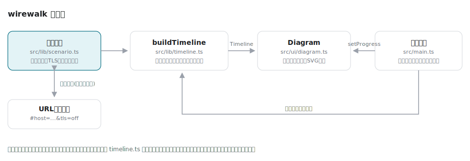

# wirewalk

[](https://github.com/miruky/wirewalk/actions/workflows/ci.yml)
[](https://github.com/miruky/wirewalk/actions/workflows/deploy.yml)
[](https://www.typescriptlang.org/)
[](https://opensource.org/licenses/MIT)

**URLを開いた瞬間に起きるDNS解決・TCPハンドシェイク・TLSネゴシエーションを、ステップ実行で歩いて眺めるシーケンスビューア**

## 概要

wirewalk は、ブラウザがWebサーバと話し始めるまでの裏側をシーケンス図のアニメーションで見せる教材である。ブラウザ・フルリゾルバ・ルート/TLD/権威DNSサーバ・Webサーバの6者を縦のライフラインとして並べ、DNSの反復問い合わせ、TCPの3ウェイハンドシェイク、TLSネゴシエーション、HTTPのやりとり、TCPの全二重クローズまでを一歩ずつ進められる。各ステップには「いま何が起きていて、なぜ必要か」の解説と、片道遅延を積み上げた概算の経過時間が付く。

ホスト名は自由に変えられ、HTTPSを切るとTLSフェーズが図から消え、DNSキャッシュ命中にするとルートへの旅が2ステップの即答に縮む。TLSは1.3(1-RTT)と1.2(2-RTT)を切り替えられ、往復遅延を変えると経過時間がそのぶん伸びる。1.3に上げると握手が1往復ぶん短くなる理由が、数字で並んで見える。条件はURLハッシュに載るので、授業や記事には「共有」ボタンで取った「この条件の図」へのリンクをそのまま貼れる。表示はライト・ダークに対応し、設定はブラウザに残る。

公開先: https://miruky.github.io/wirewalk/

### なぜ作ったのか

「URLを打ってからページが出るまでに何が起きるか」は定番の面接質問になるほど基本でありながら、文字で読むと退屈で、パケットキャプチャで見ると情報過多になる。中間にある「動く絵で、一歩ずつ、日本語の説明付き」が欲しかった。実際の通信を観測するツールではなく、代表的な流れを正確に再現する教材に振り切っている。

## アーキテクチャ



シナリオ(ホスト名と、HTTPS・TLSバージョン・DNSキャッシュ・往復遅延の各設定)から `buildTimeline` が登場ノードとステップ列、各ステップの経過時間を決定的に生成する。ステップ列はラベル・解説・フェーズ順序まで純粋なデータなので、教材としての正確さはすべてユニットテストで担保できる。描画側の `Diagram` は全ステップ分の矢印を先に組み立てておき、進行はクラスの付け替えだけで切り替えるため、巻き戻しも一瞬で終わる。

## 技術スタック

| カテゴリ             | 技術                                  |
| :------------------- | :------------------------------------ |
| 言語                 | TypeScript 5(strict、実行時依存なし)  |
| ビルド               | Vite 8                                |
| テスト               | Vitest 4 + happy-dom                  |
| リンタ・フォーマッタ | ESLint 9(typescript-eslint)+ Prettier |
| CI / 配信            | GitHub Actions + GitHub Pages         |

## 使い方

ホスト名を入れて「この条件で見る」を押し、再生か「進む」で歩を進める。右側のフェーズ目盛りは全体の俯瞰を兼ね、押すとそのフェーズの先頭へ飛ぶ。速度は0.5倍から2倍まで選べ、選んだ速度はブラウザに残る。右上の「共有」で現在の条件のURLをコピーでき、「保存」で表示中の図をそのまま単体のSVGファイルに書き出せる。隣のボタンでテーマを自動/ライト/ダークに切り替えられ、設定はブラウザに残る。

キーボードでも操作できる(`?` でこの一覧を画面に出せる)。

- `Space` — 再生 / 一時停止
- `→` / `←` — 1ステップ進む / 戻る
- `Home` / `End` — 最初へ / 最後へ
- `1`–`5` — 各フェーズの先頭へ飛ぶ

| 条件              | 図の変化                                                                     |
| :---------------- | :--------------------------------------------------------------------------- |
| HTTPS(既定)       | TLSの握手が入り、HTTPは暗号化された便として説明される                        |
| HTTPSを外す       | TLSフェーズが消え、平文で流れる危うさが解説に変わる                          |
| TLS 1.2を選ぶ     | 握手が3ステップ(1-RTT)から4ステップ(2-RTT)に増え、経過時間が一往復ぶん伸びる |
| DNSキャッシュ命中 | ルート・TLD・権威への反復問い合わせが消え、リゾルバが即答する                |
| 往復遅延を変える  | 各ステップの経過時間が比例して伸縮し、握手の往復の重みが見える               |

たとえば既定の `example.com`(HTTPS・TLS 1.3)への接続は次の20ステップになる。TLS 1.2にすると握手が1ステップ増えて21ステップになる。

```
DNS解決            8ステップ(スタブ→フルリゾルバ→ルート→TLD→権威の反復)
TCPハンドシェイク   3ステップ(SYN / SYN-ACK / ACK)
TLSネゴシエーション 3ステップ(ClientHello / ServerHello一式 / Finished)
HTTPやりとり        2ステップ(GET / 200 OK)
TCPクローズ         4ステップ(FIN / ACK / FIN / ACK)
```

実際の通信は一切行わない。表示されるIPアドレス・シーケンス番号・TTLは説明のための例示で、ポート番号や再送・輻輳制御などは扱わない。

## プロジェクト構成

- `src/lib/` — DOM非依存のロジック。シナリオ定義とURLハッシュ変換(`scenario.ts`)、ステップ列と経過時間の生成(`timeline.ts`)、テーマ設定の解決(`theme.ts`)
- `src/ui/` — DOMを扱う層。シーケンス図のSVG構築・進行表示・単体SVGの書き出し(`diagram.ts`)、フェーズの目盛りと現在地表示(`phaserail.ts`)
- `src/main.ts` — 画面の組み立て、再生制御、キーボード操作、書き出しと共有
- `docs/` — 構成図
- `public/` — ロゴ・ファビコン
- `.github/workflows/` — CI(lint・テスト・ビルド)とGitHub Pagesへのデプロイ

## はじめ方

### 前提条件

Node.js 24以上。

### セットアップ

```bash
git clone https://github.com/miruky/wirewalk.git
cd wirewalk
npm ci
npm run dev
```

### テストの実行

```bash
npm test
```

### Lintの実行

```bash
npm run lint
```

### ビルドとデプロイ

```bash
npm run build
```

GitHub Pagesのようにサブパスへ配信する場合は `WIREWALK_BASE=/wirewalk/` を付けてビルドする。`main` へのpushで `deploy.yml` がビルドとPagesへの反映まで行う。

## 設計方針

- **タイムラインは純粋なデータ** — どのノードが登場し、どんなラベルと解説で何ステップ進むかをすべて `buildTimeline` の戻り値に閉じ込めた。教材の正確さ(TLS 1.3が1-RTTであること、TCPクローズが4ステップであること等)は文章ではなくテストで固定している。
- **描画は組み立てと進行を分離** — 矢印は最初に全ステップ分作り、進行はインデックスに応じたクラス切替だけにした。再生・巻き戻し・段送りが同じ操作に落ち、状態の食い違いが起きない。
- **書き出しは同じ図を使い回す** — 「保存」で得られるSVGは、画面と同じDOMを複製してCSS変数を具体値に焼き直しただけのもの。別の描画系を持たないので、画面と書き出しがずれることがない。
- **観測ツールではなく教材** — 実トラフィックには触れない。その代わり数値や順序を固定して再現性を持たせ、同じ図を何度でも見返せるようにした。
- **モーションは意味のある箇所だけ** — いま起きているステップにだけパケットの粒を流し、`prefers-reduced-motion: reduce` では止める。

## ライセンス

[MIT](LICENSE)
